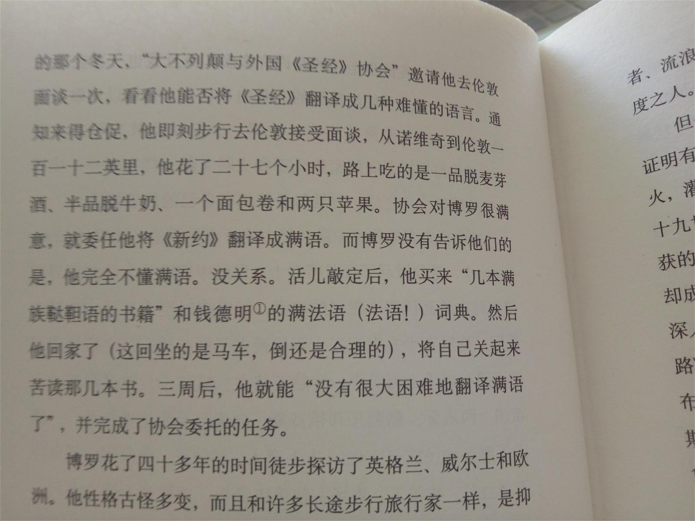

# 基于"关于非程序员解决程序问题的语言和结构研究"的两个猜想

## Studying the Language and Structure in Non-programmers' Solutions to Programming Problems

[PDF](http://alumni.cs.ucr.edu/~ratana/PaneRatanamahatanaMyers00.pdf)

## 实验简述（以下条件都与第一点对应）
* 分组：两组
  + 小学生（10-11岁五年级学生，14人）
  + 小学生+计算机领域外的成人（10-11岁五年级新生，22人 + 18-34岁成人，19人）
* 地域范围
  + Pittsburgh public elementary school
  + Pittsburgh public elementary school + Carnegie Mellon University community
* 性别分布
  + 7男7女
  + 13男9女+10男9女
* 种族：任何
* 实验取材
  + 9个PacMan game场景
  + 11个程序员在操作过程中会遇到的问题
* 参与者有无编程经历
  + 2声称有，12无
  + 14（11男3女）无，8有+5（2男3女）无，14有
* 结果如何呈现
  + 百分比
* 如何实验
  + 参与者描述如何解决问题
* 评价标准
  + 根据实验对象解决问题的描述进行分类
* 评价人员
  + 5个程序员独立评价
  
## 评价
我们可以从上述的列举中看出实验基本客观，但是受到地域和人数的限制。不管如何实验确实带给我们很多启迪和思考，因为目前所用的编程语言确实存在和人类用语习惯差距很大的问题。开头笔者也列出了原因：**在设计计算机语言的时候缺少对人机交互问题的细致考量**，于是基于整个实验以及文中对计算机语言的描述等等信息，我对计算机语言走向有两个猜想：

## 猜想
### 猜想一：从过去失落的语言或者其它规则严密的小语种当中寻找新的灵感
猜想一首先基于我学法语二外时的一些经验：跟英语语法相比，法语语法规则更严密精细得多。有些欧洲历史小常识的人都知道现代英语很多的词汇都来源于法语，尽管两者并不属一个语系。但是这一切的一切都要追溯回拉丁语，尽管拉丁语已经是死去的语言之一。无疑，拉丁语让人头疼的地方在于它过于繁冗的规则，规则会让语言显得死板，但是这又恰恰符合机器的特性，因为机器是没有生命的。这一猜想第二基于反对西方中心主义的呼声，我们无法预测下一个时代哪一种语言会是风靡全球的语言。
#### 基于猜想一可能需要的条件、方法
这一灵感来源于*Polygolt Programming*，这篇论文进一步探讨了如何通过提取各个语种中的优势来解决编程语言的表达问题。在这篇论文所预设的情况下参与的人员需要具备一定的**条件**，而设计的过程也需要**方法和工具**。
##### 人员条件
* 多语种使用者
* 熟悉计算机语言
* 熟悉所使用语言的语法结构
* 具备语言学知识
* 拥有自我学习新语种的能力
* 所有的参与人需共通一门语言（尽可能小的避免概念交流中的误差）
  
  > 这里需要引入一个非常理想的人选，尽管他生活在一个根本没有计算机的时代，这个人是[George Borrow](https://en.wikipedia.org/wiki/George_Borrow)
  
  > 下面是Robert Macfarlane在书中对他的描述:
  
  > 
  
  > 

##### 方法和工具
* 基于大数据的语料库（灵感来自译云）
* 合作平台（灵感来自译言）

### 猜想二：创造或者发展一个新的**世界语**
这一猜想基于我对语言是如何形成的疑惑，并没有一本语言学书能够完完全全解答这一问题。我们可以把创造计算机语言的这个时间看做是一个新语言产生的时候（实际上它就是），我们不习惯使用是因为这一语言并没有融入进我们从小到大的生活中去。同时，这一猜想来源于两个人加一T恤：
* [拉扎鲁·路德维克·柴门霍夫](http://baike.baidu.com/view/469207.htm?fromtitle=%E6%9F%B4%E9%97%A8%E9%9C%8D%E5%A4%AB&fromid=1710381&type=search)发明[世界语](http://baike.baidu.com/link?url=-WPZq6K7MVirlOWRmawXk-kcGvhxyJxOETYziawhq-mV-5Tp8iPIGST5VSw3sZxvObccihn_TGlHcpDP2cxEza)
* [约翰·罗纳德·瑞尔·托尔金](http://baike.baidu.com/link?url=nyNmk6NUXaj34kN9cYqoygXAf31oPHYsoWtF_7oUpes3me0QL5gFPXGWKX8sFtWoI6dEthk8BHyUIVip2JYZsfIq5b8C_xEiYKZwaT6vQOwr2wZBiZZcZAlzcPToJvbvfWc-tIQmgEQSEeLdN1WtvKDvAub-eoMXNz-unY8h5dS9Z57PNKO5uIImma8Iu8Wg)发明[精灵语](http://baike.baidu.com/link?url=Y8psIcri_vqwj9Qx5mY1dX_5Sl3UCkT5un1O86Rk-w_nc0WJfE0btHop0DF70k8SBMF-a66vDtb_X5F0zhCgFa)
* T恤
  
  

我们可以类比这样两个时刻，即计算机语言发展到如今的时刻与上述两个人发明的语言以及历史上任何一种语言在发展过程中与之对应的时刻。尽管和英语以及其它相对来讲自然产生且由多人产生的语言相比，上述两者语言的发明可精确到个人，且使用范围很窄，但它们与计算机语言有着相似的特性：**人造的**，**使用范围窄的**。而与它们不同的、且有优势的一点是：**我们正迎来大数据的时代，掌握计算机的语言是大势所趋**。

而这件T恤带给我们的启示便是我曾经反复强调的观点：**语言可以被看成承载意义的符号**。最近很火的这个“走遍全球都不怕的”T恤是一个浅显易懂的例证。这一观点来源于[米凯尔·巴赫金](http://baike.baidu.com/link?url=RWavzT1AV4E0ms2Gg5tHv-2Ub8cGI7lb0JwTWGtlNxVyZ1EnWy7c02WILH-g_0hWzG3jDAmsXQcyGyXvrqeesq_yjh3q6EgWhcGpoNiVN-7)，是符号学中的一个重要观点，也日渐流行于语言学的领域中。这件T恤的流行背后给我们带来了后现代语言发展的一些预示，这些预示来源于我们的需要：**对交流中输入输出对等的需要**。

我们所头疼的问题也许是计算机语言发展过程中的问题，同任何一个语言发展过程中遇到问题一样，解决问题的办法可能也非彻底的颠覆，而是一次又一次的修复bug。这还因为这一问题的根源在于：**我们处于一个转型时期**，在我们这一代人所受的教育中对计算机技术、语言的教育并不像那些基础学科教育一样系统、普及。尽管到它们普及还要花上许多年的时间，但“计算机语言不会成为拦截大部分人的门槛”这一结果也是可以预见的。

## 猜想一与二之间的关联
**一是二的基础，二是一未来。**

我想把这个关联比作计算机语言界的“文艺复兴”。众所周知，文艺复兴是中世纪以后掀起的一场学习古希腊、罗马的风潮，但是实际上是打着“复兴”的旗号，进行新的变革。借鉴过去的语言和从过去发展至今的语言是一种思路，这种思路最终要通向的结果是计算机语言的革新、是从**小范围的人造到大规模的使用以及大范围自然而然的发展**，或许几百年甚至几千年以后，计算机语言的发展将作为人类语言发展过程中一个具有划时代意义的案例而载入史册。
